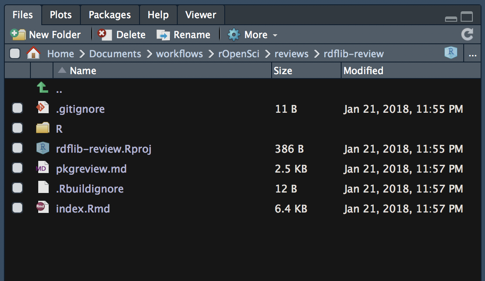

# pkgreviewr

The goal of pkgreviewr is to facilitate **rOpenSci** package reviews.

## Installation

You can install pkgreviewr from GitHub with:


``` r
# install.packages("devtools")
devtools::install_github("annakrystalli/pkgreviewr")
```

## Example

### create review project

This is a basic example which shows you how to solve a common problem:


First, create the review project, using `pkgreview_create`. The function takes arguments `pkg_repo`, the repo details in the form `username/repo` and `review_dir`,
the directory in which the review project will be created.

The functions creates a new review project (or prompts for instruction if it already exists) and navigates to the project root.

``` r
library(pkgreviewr)
pkgreview_create(pkg_repo = "cboettig/rdflib", 
                 review_dir = "~/Documents/workflows/rOpenSci/reviews/")
```

### initialise review

Next, initialise the review project with the materials you'll need.

``` r
library(pkgreviewr)
pkgreview_init("cboettig/rdflib")

```


<br>

### `index.Rmd` 

The most important file it creates `index.Rmd html_notebook` file. This workbook is prepopulated with all the major steps required to complete the review in an interactive document to perform and record it in. It also extracts useful links, information and parameter values. See **example [here](https://github.com/annakrystalli/pkgreviewr/blob/master/inst/examples/example-review-index.Rmd).**

Once rendered to `index.nb.html`, this report can be pushed to github for publication which needs to be pushed to github for the report

### `clone of package source code` 

Initialisation also clones package source code from github to a second new directory, in the same directory and depth as the review project to perform local testing.


### `pkgreview.md` 

Template response form to submit to the package rOpenSci onboarding review issue. See template [here](https://github.com/annakrystalli/pkgreviewr/blob/master/inst/examples/example-pkgreview.md) 

### `README.md` 

Prepopulated README for the review repo. See example [here:](https://github.com/annakrystalli/pkgreviewr/blob/master/inst/examples/example-README.md)

***

# Review workflow

1. Create review project 
1. Initialise project
1. Create blank (don't autimatically create any files on GitHub) review repository on `github` and link. 
    - Follow naming convention `"{pkgname}-review"`.
    - Link local review project to the repository through the terminal, eg
    ```
    git remote add origin https://github.com/annakrystalli/rdflib-review.git
    git push -u origin master
    ```
1. Open `index.Rmd` and work through the review in the notebook. You can make notes either in `index.Rmd` or directly in the `pkgreview.md` response file.
1. Submit your review in the package `ropensci/onboarding` issue by copying and pasting the completed template.
1. Publish your report by pushing to github.


### n.b.

For package to function correctly, the user will need to have their github account confirmed on the machine they are using.

To configure your git user settings, run the following command in the terminal, substituting with your github credentials.
```
git config --global user.name 'Anna Krystalli'
git config --global user.email 'annakrystalli@googlemail.com'
```

To check you current git configuration, run:
```
git config --global --list
```
